# Dam Break Inundation Modelling & Flood Digital Twin
## End-to-End System Architecture & Functional Specification

> **Smart India Hackathon 2026**  
> **Problem Statement ID:** 26161 — *Dam Break Inundation Modelling Using Hydrodynamic Modelling of any River*  
> **Theme:** Disaster Management | **Team:** InVictus_165 | **Category:** Software  

---

## 1. Executive Summary & Purpose

The **Dam Break Inundation Modelling & Flood Digital Twin** platform is a generalized hydrodynamic framework designed to model, simulate, and visualize catastrophic dam-break flood waves and river blockages across any river basin and terrain digital elevation model (DEM).

The platform bridges numerical fluid dynamics with modern spatial web engineering, uniting:
1. **Multi-Physics Hydrodynamic Solvers**: 2D Saint-Venant / Manning kinematic and diffusion wave propagation, empirical breach mechanics (Froehlich, MacDonald-Langridge, Von Thun), and a comparative multi-physics engine contrasting near-field Smoothed Particle Hydrodynamics (SPH) against valley-scale Delft3D-FLOW.
2. **Synchronized 4D Digital Twin**: Simultaneous playback linking 2D GIS raster/vector flood propagation with real-time 3D WebGL dam and canyon digital twins for both **Mettur Dam** (Stanley Reservoir) and **Tehri Dam** (Bhagirathi River).
3. **Automated Impact Assessment**: Real-world OpenStreetMap (OSM) building footprint extraction and highway lifeline vulnerability scoring.
4. **Earth Observation & Validation**: Sentinel-1 Synthetic Aperture Radar (SAR) change detection and Google Earth Engine (GEE) satellite monitoring.
5. **Government & Disaster Readiness**: Automated generation of Dam Safety Act (DSA) compliant technical reports, evacuation zoning, and GIS-ready data export packages (ESRI Shapefiles, Google Earth KML, and GeoTIFF rasters).
6. **UN Sustainable Development Goals**: Explicit alignment with SDG 11 (Sustainable Cities), SDG 13 (Climate Action), SDG 6 (Clean Water), and SDG 9 (Resilient Infrastructure).

```mermaid
graph TD
    UI[Web Browser UI: React 18 + TypeScript]
    subgraph UI_Components [Frontend Views & Modals]
        Map2D[2D GIS Map - MapLibreGL + WebGL Particles]
        Twin3D[3D Physical Twin - Three.js / WebGL]
        Nav[Global Navigation & Mode Controller]
        Modals[Modals: SPH vs Delft3D, GEE, AI Predictor, Exports, Scenarios]
        Report[Dam Safety & EAP Report View]
        Val[Physics Validation View]
    end

    UI --> UI_Components

    subgraph Backend_Services [FastAPI Backend Service]
        API_Sim[Simulation API & Job Worker]
        API_Sat[Satellite & GEE Processor]
        API_Exp[GIS Export Engine: SHP, KML, GeoTIFF]
        API_Rep[Report Generator & Metrics Engine]
    end

    UI_Components <-->|REST & JSON API| Backend_Services

    subgraph Physics_Engines [Hydrodynamic & Computational Engines]
        Breach[Breach Formulations: Froehlich, MacDonald, Von Thun]
        Manning2D[Generalized 2D Routing Engine: Manning Kinematic/Diffusion]
        SPH_Delft[SPH vs Delft3D Multiphysics Comparator]
        AI_Surrogate[AI/ML Hydrograph Surrogate Predictor]
    end

    Backend_Services --> Physics_Engines

    subgraph Data_Layer [Spatial & Database Layer]
        DB[(SQLite / PostgreSQL + PostGIS)]
        DEM[(DEM Rasters: SRTM 30m / CartoDEM)]
        River[(River Vector Centerlines)]
        OSM[(OSM Buildings & Highway Networks)]
        SAR[(Sentinel-1 SAR Water Masks)]
    end

    Physics_Engines <--> Data_Layer
    Backend_Services <--> Data_Layer
```



---

## 2. Core Views & User Interface Components

The system interface is structured into 6 primary operational views, accessible via the top navigation bar.

### 2.1 Top Navigation Bar (`Navbar.tsx`)
The persistent global controller that orchestrates the simulation state across all views:
- **Brand & Hackathon Indicator**: Displays system identity, version tag (`HYDRODYNAMIC v1.0`), and competition identifier (`SIH PS 26161`).
- **Dam Search & Selector (`DamSearchModal.tsx`)**: Global registry lookup allowing rapid search by state, river, or structural attributes, instantly loading project datasets.
- **Scenario Selector**: Dropdown enabling instant failure mode selection (Overtopping, Piping, Full Structural Failure, Landslide Surge, Custom).
- **Simulation Mode Switcher**:
  - `Real-Time`: Authoritative CWC telemetry, design flood, and published reservoir stage-storage baseline.
  - `Manual Sliders`: Unlocks user-defined parameter overrides.
- **Compute Simulation Button (CPU Icon)**: Triggers the FastAPI background worker to execute numerical hydrodynamic routing on the backend, with an animated real-time progress bar.
- **Action Buttons**:
  - **`AI Predictor`**: Opens machine-learning hydrograph surrogate estimator.
  - **`GEE Real-Time`**: Launches Google Earth Engine satellite observation modal.
  - **`Scenarios`**: Opens side-by-side multi-scenario comparative analysis.
  - **`SPH vs Delft3D`**: Launches the multiphysics comparison dashboard.
  - **`Report`**: Opens the Dam Safety Act automated compliance report.
  - **`Validation`**: Opens physics conservation and flume experiment verification.
  - **`Export`**: Opens the GIS & Shapefile download center.

---

### 2.2 View 1: National Dam Overview (`IndiaDamMap.tsx`)
- **What It Does**: Provides an interactive geospatial map of major dam assets across India.
- **Interactive Capabilities**:
  - Color-coded map markers indicate structural height, storage volume, and telemetry status.
  - Clicking any dam opens a summary sheet showing crest length, dam type, commission year, and river basin.
  - Direct quick-launch action buttons to open that dam immediately in the **2D GIS Map** or **3D Digital Twin**.

---

### 2.3 View 2: 2D GIS Hydrodynamic Map (`ProjectView.tsx` & `MapLibreMap.tsx`)
- **What It Does**: The primary GIS operations dashboard for flood hazard mapping and infrastructure risk assessment.
- **Interactive Layers**:
  1. **Dynamic Flood Inundation Envelope**: Color-ramped water depth grid ($0.15\text{ m}$ to $>30\text{ m}$) changing dynamically with the simulation clock.
  2. **Particle Velocity Advection Layer (`FloodParticleLayer.ts`)**: A custom MapLibre WebGL GPU shader rendering thousands of animated water particles that advect strictly along the velocity gradient of the flood wave.
  3. **Wave Arrival Isochrones**: Iso-time contour lines showing the exact arrival time of the flood front at downstream sections (e.g., $15\text{ min}$, $30\text{ min}$, $1\text{ hr}$, $2\text{ hr}$).
  4. **Submerged Buildings**: Building footprints derived from OpenStreetMap, dynamically color-coded by water depth (Yellow: $0.15\text{--}0.5\text{ m}$, Amber: $0.5\text{--}1.5\text{ m}$, Red: $>1.5\text{ m}$).
  5. **Severed Transportation Lifelines**: Highway and roadway polylines highlighted in crimson when cut off by floodwaters.
- **Side Panels & Controllers**:
  - **HUD Metric Cards (`MetricCards.tsx`)**: Live readouts of Peak Discharge ($Q_p$), Max Depth ($h_{\max}$), Max Velocity ($v_{\max}$), Flooded Land Area ($\text{km}^2$), and Total Exposed Population.
  - **Breach Hydrodynamics Flyout**: Technical readouts of breach dimensions ($B_{\text{avg}}$, $t_f$, $h_b$, $z$), active solver status, and an interactive SVG plot of the outflow hydrograph $Q(t)$.
  - **Compare with Sentinel-1 SAR Button**: Executes quantitative overlap validation against real Sentinel-1 C-Band SAR radar observations.
  - **Synchronized 4D Timeline Scrubber (`TimelineSlider.tsx`)**: Global clock controller with Play/Pause, speed multipliers ($1\times, 5\times, 10\times, 30\times$), time readout ($T+01:30$), and live discharge/area telemetry.

---

### 2.4 View 3: 3D Physical Digital Twin (`DigitalTwin3D.tsx`)
- **What It Does**: A physical 3D WebGL/Three.js digital twin of the dam structure, canyon, reservoir, and downstream floodplain.
- **Features for Supported Dams**:
  - **Mettur Dam (Stanley Reservoir)**:
    - 320-component masonry dam structure, 16 animated spillway radial gates (`GATE_CTRL_00` to `15`), winch control cabins, valley abutments, and downstream energy-dissipating apron baffles.
  - **Tehri Dam (Bhagirathi River)**:
    - Full 260.5 m rock-fill embankment, spillway chute structures, reservoir body, 93 OSM road corridors, and 6 sequential 3D flood propagation envelopes surging through the Himalayan river gorge.
- **Interactive Camera Presets**:
  - **Overview**: High-angle perspective showing reservoir, dam, and valley.
  - **Crest View**: First-person perspective looking down the spillway face.
  - **Downstream Valley**: View looking upstream from the river bed toward the advancing wave.
  - **City / Settlement**: Downstream population center perspective.
  - **Top-Down Aerial**: Orthographic nadir inspection view.
- **Interactive Controls**:
  - Full free-orbit 3D navigation (rotate, pan, zoom).
  - Synchronized water elevation shader with dynamic wave ripple, foam effects, and level decline as the reservoir empties through the breach.

---

### 2.5 View 4: Authoritative Data Catalog (`DataSourcesView.tsx`)
- **What It Does**: Complete provenance and transparency dashboard cataloging all foundational geospatial and hydrological datasets:
  - **Elevation DEMs**: SRTM 30m / CartoDEM raster bounds, pixel resolutions, and coordinate reference systems (CRS: EPSG 4326 / UTM).
  - **Hydrology & River Networks**: Vectorized river centerlines, reach stations, longitudinal slope profiles, and Manning's roughness coefficients ($n$).
  - **Infrastructure Footprints**: OpenStreetMap building polygons and highway network vectors used for vulnerability scoring.
  - **Reservoir Stage-Storage**: Central Water Commission (CWC) elevation-area-capacity curves linking water levels to active failure storage volumes.

---

### 2.6 View 5: Dam Safety & EAP Report (`ReportView.tsx`)
- **What It Does**: Automated technical reporting compliant with the **Dam Safety Act (DSA)** and CWC guidelines.
- **Key Sections in Generated Report**:
  1. **Executive Summary & Key Results**: Peak discharge, max depth, peak flow velocity, and total inundated area.
  2. **Boundary Conditions**: Crest elevation, structural height, reservoir capacity, and active failure volume.
  3. **Breach Hydraulics**: Computed Froehlich/MacDonald breach geometry ($B_{\text{avg}}$, $W_b$, $h_b$, $t_f$, $z$).
  4. **Infrastructure & Exposure Impact**: Impacted building breakdown by hazard tier, severed road length (km), and population at risk.
  5. **Humanitarian Assistance & Disaster Relief (HADR) Action Plan**: Phased evacuation timelines:
     - **Zone 1 (Immediate Danger)**: Arrival $<30\text{ min}$ ($<10\text{ km}$ downstream) — Immediate vertical & lateral high-ground evacuation.
     - **Zone 2 (Secondary Inundation)**: Arrival $30\text{--}120\text{ min}$ ($10\text{--}35\text{ km}$) — Controlled vehicular egress along identified open corridors.
     - **Zone 3 (Floodplain Monitoring)**: Arrival $>120\text{ min}$ ($>35\text{ km}$) — Emergency relief staging and potable water distribution.
  6. **Scientific Limitations & Assumptions**: Explicit documentation of model assumptions and numerical approximations.
  7. **UN Sustainable Development Goals (SDGs)**: Strategic alignment with SDGs 11, 13, 6, and 9.
  8. **Print / Export to PDF**: Native one-click browser print and PDF export styling.

---

### 2.7 View 6: Physics & Scientific Validation (`ValidationView.tsx`)
- **What It Does**: Rigorous engineering validation proving model compliance with fluid dynamics laws.
- **Validation Modules**:
  - **Mass Conservation Balance**: Calculates numerical discrepancy between reservoir volume drained and the integral of the hydrograph:
    $$\Delta V = \int_0^{t_f} Q(t)\,dt - V_{\text{active}}$$
    Guarantees mass conservation within $<0.0001\%$.
  - **Analytical Dam-Break Benchmarks**: Compares numerical wave velocity against the classic Ritter (1892) dry-bed analytical solution and Stoker (1957) wet-bed hydraulic jump equations.
  - **Physical Flume Verification (CADAM)**: Validates arrival times and depth profiles against the European Concerted Action on Dam-Break Modelling experimental laboratory flume datasets.
  - **Sensitivity Analysis**: Assesses variation in inundation extent across different Manning roughness coefficients ($n = 0.025\text{ to }0.055$) and time-step discretization ($\Delta t$).

---

## 3. Specialized Action Modals & Tools

### 3.1 SPH vs. Delft3D Multiphysics Benchmark (`SPHDelft3DCompareModal.tsx`)
- **What It Does**: Evaluates the differences between Lagrangian particle-based hydrodynamics (Smoothed Particle Hydrodynamics) and Eulerian mesh-based hydrodynamics (Delft3D-FLOW).
- **Tabs**:
  - **Overview**: Comparison of numerical schemes (Navier-Stokes vs. Shallow Water Equations), runtime, particle count ($185,000+$) vs. cell count ($45,000$), and CFL stability criteria.
  - **Downstream Stations**: 5 monitoring chainages (Dam Toe, Gorge/Bridge, Valley Entrance, Urban Outskirt, Floodplain) detailing arrival times, peak depths, flow velocities, and Froude numbers ($Fr$).
  - **Hydrograph Overlay**: Synchronized curve plotting SPH discharge against Delft3D discharge over time.
  - **Cross-Section Transects**: 3 transverse valley profiles showing water surface elevation ($m\text{ MSL}$) across narrow gorges, meandering valleys, and urban plains.
  - **Scientific Synthesis**: Engineering rationale explaining where SPH provides upper-bound structural impact data and where Delft3D governs regional evacuation mapping.

---

### 3.2 Sentinel-1 SAR Comparison Engine (`api/satellite.py`)
- **What It Does**: Validates model flood envelopes against real Copernicus Sentinel-1 C-band Synthetic Aperture Radar (SAR) observations.
- **Quantitative Metrics Computed**:
  - **IoU (Jaccard Index)**: $\frac{\text{Area}(\text{Model} \cap \text{SAR})}{\text{Area}(\text{Model} \cup \text{SAR})}$
  - **F1-Score**: $2 \times \frac{\text{Precision} \times \text{Recall}}{\text{Precision} + \text{Recall}}$
  - **Precision**: Fraction of simulated flood correctly confirmed by satellite.
  - **Recall**: Fraction of satellite-detected water captured by the numerical simulation.
  - **Spatial Notes**: Explains temporal offsets between flash flood peaks and satellite orbital revisit periods.

---

### 3.3 Google Earth Engine Real-Time Analysis (`GEEFloodAnalysisModal.tsx`)
- **What It Does**: Connects to Google Earth Engine (GEE) to retrieve optical (Sentinel-2 / Landsat) and radar (Sentinel-1 SAR) imagery for the dam catchment and downstream river reach.
- **Capabilities**:
  - Interactive GEE parameter configuration (pre-flood and post-flood date pickers, radar polarizations VV/VH, dB threshold).
  - Automated cloud-masking and water surface change detection overlay.

---

### 3.4 AI Hydrograph Surrogate Predictor (`AIPredictorModal.tsx`)
- **What It Does**: Machine-learning surrogate trained on historical dam-break case studies (Teton, Vajont, Banqiao, Machchu-II) that provides sub-second estimations of:
  - Peak Breach Discharge ($Q_p$) in $\text{m}^3/\text{s}$
  - Time to Peak ($t_p$) in minutes
  - 95% Confidence Intervals
  - Enables instant sensitivity testing before running full 2D hydrodynamic solver passes.

---

### 3.5 Scenario Comparison Modal (`ScenarioCompareModal.tsx`)
- **What It Does**: Enables side-by-side comparison of multiple breach failure scenarios for the same dam.
- **Capabilities**:
  - Overlays hydrograph curves for Overtopping, Piping, Full Structural Failure, and River Blockage.
  - Displays comparative tables contrasting peak outflow, inundation area ($\text{km}^2$), time to peak, and downstream hazard categorization.

---

### 3.6 GIS & Model Export Center (`ExportModal.tsx`)
- **What It Does**: Provides one-click exports of simulation results in standard GIS formats for use in QGIS, ArcGIS, Google Earth, and emergency operations software:
  - **ESRI Shapefiles (ZIP packages containing `.shp`, `.shx`, `.dbf`, `.prj`)**:
    - Flood Inundation Extent Polygon
    - Impacted Building Footprints with Risk Stratification
    - Severed Transportation Corridors
  - **Google Earth Keyhole Markup Language (`.kml`)**:
    - 3D clamp-to-ground flood boundary polygons and evacuation corridors.
  - **Hydraulic GeoTIFF Rasters**:
    - Maximum Depth Raster (`max_depth.tif`)
    - Maximum Velocity Raster (`max_velocity.tif`)
    - Arrival Time Isochrone Raster (`arrival_time.tif`)
  - **Executive Summaries**:
    - Raw CSV hydrograph time series and printable summary documents.

---

### 3.7 Manual Simulation Parameter Sliders (`ManualSimulationModal.tsx`)
- **What It Does**: Interactive parameter customization allowing hydrologists to test extreme, what-if scenarios:
  - **Reservoir Water Level ($H_w$)**: Slider from minimum drawdown up to maximum surcharge.
  - **Active Reservoir Volume ($V_w$)**: Scalable up to full gross storage.
  - **Breach Bottom Width ($W_b$) & Side Slopes ($z$)**: Fine-grained geometry tuning.
  - **Breach Formation Time ($t_f$)**: Rapid instantaneous burst vs. gradual erosion.
  - **Manning's Roughness Coefficient ($n$)**: Sensitivity slider ($0.020\text{ to }0.080$).

---

## 4. End-to-End Simulation Workflow

```mermaid
sequenceDiagram
    autonumber
    actor User as Hydrologist / User
    participant Nav as Navigation Bar
    participant App as React Application
    participant API as FastAPI Backend
    participant Solver as 2D Routing Engine
    participant GIS as Post-Processor & GIS
    participant Twin as 3D Twin & 2D Map

    User->>Nav: Selects Dam (Tehri / Mettur) & Scenario
    Nav->>App: Updates global project & scenario state
    User->>Nav: Clicks "Compute Simulation"
    Nav->>API: POST /api/simulation/run {project_id, scenario_id}
    API-->>App: Returns simulation_id (Job QUEUED)
    
    rect rgb(20, 30, 50)
        Note over API,Solver: Asynchronous Background Worker
        API->>Solver: Validates terrain DEM, river reach, stage-storage
        Solver->>Solver: Calculates Breach Hydrograph Q(t) (Froehlich/MacDonald)
        Solver->>Solver: Verifies Mass Conservation (integral Q dt = V_active)
        Solver->>Solver: Runs 2D Manning kinematic/diffusion propagation
        Solver->>GIS: Vectorizes flood boundary & samples depth/velocity rasters
        GIS->>GIS: Intersects OSM buildings & road lifelines
        GIS->>API: Persists results to DB & disk (GeoJSON, GeoTIFF, summary)
    end

    loop Polling Status every 1000ms
        App->>API: GET /api/simulation/status/{sim_id}
        API-->>App: Returns progress % (PREPROCESSING -> RUNNING -> COMPLETED)
    end

    API-->>App: Simulation Completed
    App->>Twin: Updates 2D MapLibre layers & 3D Three.js mesh
    User->>Twin: Presses "Play" on Timeline Scrubber
    Twin->>Twin: Animates 4D flood wave from T=0 to T=T_max synchronously
```



---

## 5. Repository File Structure & Key Modules

```
E:/dam/
│
├── backend/
│   ├── app/
│   │   ├── api/
│   │   │   ├── simulation.py      # Core simulation worker & SPH/Delft3D endpoints
│   │   │   ├── satellite.py       # Sentinel-1 SAR & GEE comparison endpoints
│   │   │   ├── projects.py        # Project CRUD & dataset binding
│   │   │   ├── scenarios.py       # Scenario failure modes & parameter definitions
│   │   │   ├── exports.py         # Shapefile, KML, and GeoTIFF download streaming
│   │   │   ├── reports.py         # HTML/PDF report generation endpoint
│   │   │   └── benchmarks.py      # CADAM flume and analytical verification
│   │   ├── hydrodynamics/
│   │   │   ├── routing_engine.py  # 2D Manning wave propagation & mass conservation
│   │   │   ├── model_comparison.py# SPH vs Delft3D comparative analysis engine
│   │   │   ├── sph/               # SPH solver modules & analytical benchmarks
│   │   │   └── delft3d/           # Delft3D-FLOW grid adapter & output parser
│   │   ├── hydrology/
│   │   │   ├── froehlich.py       # Froehlich (2008) breach geometry & timing
│   │   │   ├── macdonald.py       # MacDonald-Langridge (1984) piping formulation
│   │   │   └── von_thun.py        # Von Thun & Gillette (1990) rapid breach
│   │   ├── satellite/
│   │   │   ├── sentinel1_flood.py # Sentinel-1 SAR GRD water mask extraction
│   │   │   ├── validation_metrics.py# IoU, F1, Precision, and Recall calculation
│   │   │   └── gee_client.py      # Google Earth Engine API integration
│   │   ├── exports/
│   │   │   ├── shapefile_exporter.py # Multi-layer ESRI shapefile zip generator
│   │   │   ├── kml_exporter.py       # 3D Google Earth KML generator
│   │   │   └── report_generator.py   # Dam Safety Act technical report generator
│   │   ├── models/                # SQLAlchemy database entity models
│   │   └── core/                  # Database connections, config, and file sync
│   └── main.py                    # FastAPI entrypoint, middleware, and routers
│
├── frontend/
│   ├── src/
│   │   ├── pages/
│   │   │   ├── ProjectView.tsx    # 2D MapLibre GIS view & hydrodynamics panel
│   │   │   ├── DigitalTwin3D.tsx  # Three.js 3D twin for Mettur & Tehri
│   │   │   ├── DataSourcesView.tsx# Authoritative dataset metadata catalog
│   │   │   ├── ReportView.tsx     # Technical Dam Safety & EAP report viewer
│   │   │   └── ValidationView.tsx # Physics, Ritter/Stoker, and flume validation
│   │   ├── components/
│   │   │   ├── Navbar.tsx         # Global top navigation & controller
│   │   │   ├── TimelineSlider.tsx # 4D synchronized simulation clock scrubber
│   │   │   ├── MetricCards.tsx    # HUD summary cards (Peak Q, depth, area)
│   │   │   ├── SPHDelft3DCompareModal.tsx # SPH vs Delft3D multiphysics modal
│   │   │   ├── ExportModal.tsx    # Shapefile, KML, and GeoTIFF export center
│   │   │   ├── GEEFloodAnalysisModal.tsx  # Google Earth Engine modal
│   │   │   ├── AIPredictorModal.tsx       # ML hydrograph surrogate modal
│   │   │   ├── ManualSimulationModal.tsx  # Parameter slider configuration
│   │   │   └── ScenarioCompareModal.tsx   # Multi-scenario comparison modal
│   │   ├── map/
│   │   │   ├── MapLibreMap.tsx    # MapLibre GL JS 2D map component
│   │   │   ├── FloodParticleLayer.ts # WebGL GPU animated water particle shader
│   │   │   └── IndiaDamMap.tsx    # National dam registry overview map
│   │   ├── services/
│   │   │   └── api.ts             # Typed REST API service connector
│   │   └── types/                 # TypeScript type definitions
│   └── package.json
│
└── data/
    ├── dam_break.db               # SQLite database (projects, scenarios, results)
    ├── mettur/                    # Mettur Dam GIS datasets (DEM, River, OSM, SAR)
    └── tehri/                     # Tehri Dam GIS datasets (DEM, River, OSM, SAR)
```

---

## 6. How to Run & Verify the Platform

### 6.1 Backend API Server
```bash
cd E:\dam
$env:PYTHONPATH="."
$env:PYTHONUTF8="1"
python -m uvicorn backend.main:app --host 127.0.0.1 --port 8000 --reload
```
- Interactive Swagger API Documentation: `http://127.0.0.1:8000/docs`
- Health check: `http://127.0.0.1:8000/api/dams`

### 6.2 Frontend Application
```bash
cd E:\dam\frontend
npm run dev
```
- Local Application URL: `http://127.0.0.1:5173/`
